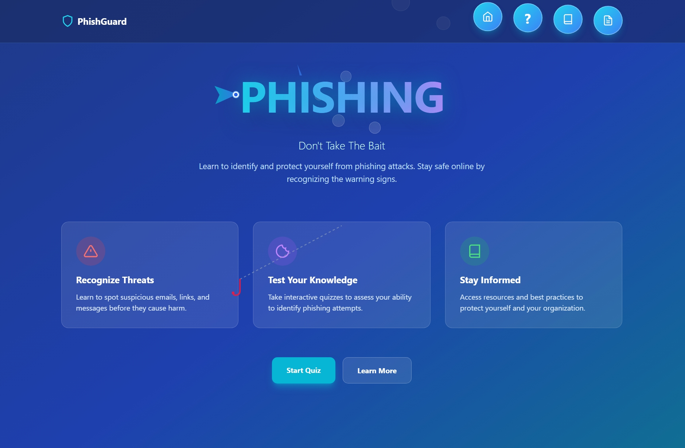
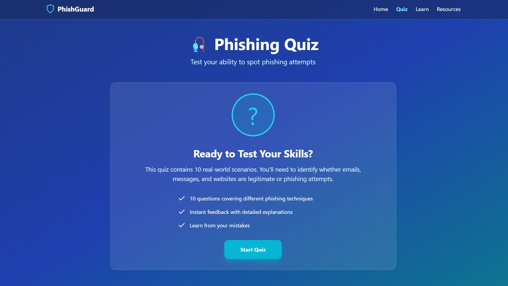
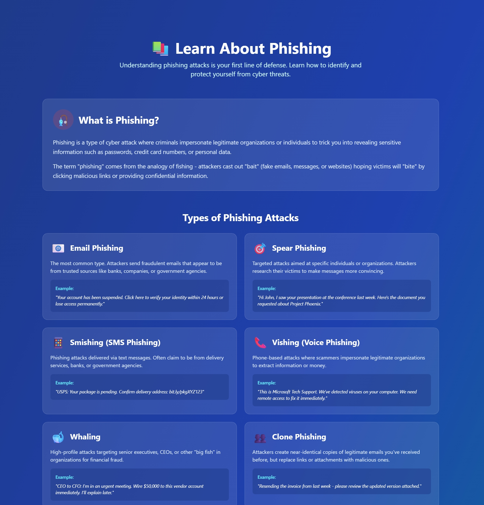
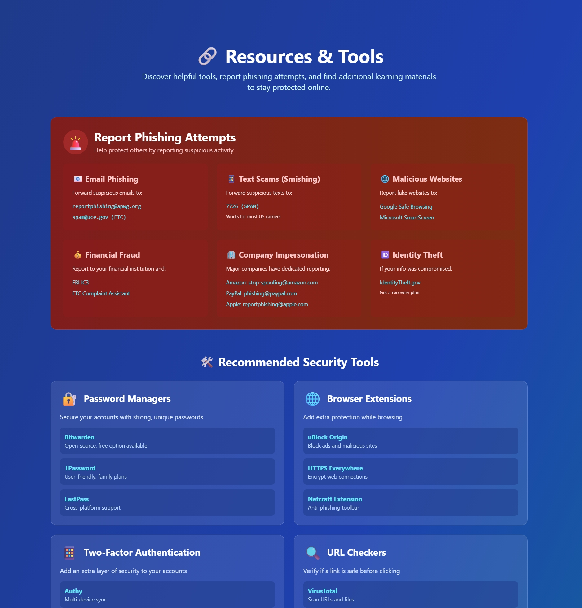

# 🎣 PhishGuard - Phishing Awareness Website


A comprehensive cybersecurity awareness platform designed to educate users about phishing attacks and help them recognize potential threats through interactive learning and hands-on quizzes.

## 🌐 Live Demo

[View Live Website](https://ashishsiwach143.github.io/phishing-awareness-site/)

## 📸 Screenshots

### Home Page

*Interactive home page featuring an animated fish design with cursor-following hook*

### Quiz Page

*10-question interactive quiz with real-world phishing scenarios*

### Learn Page

*Comprehensive educational content about phishing types and prevention*

### Resources Page

*Curated tools, reporting contacts, and security resources*

## ✨ Features

### 🏠 Interactive Home Page
- Animated fish logo with tail-wagging animation
- Cursor-tracking fishing hook with dynamic line
- Floating bubble navigation with smooth animations
- Gradient ocean-themed design
- Responsive layout for all devices

### 📝 Phishing Quiz
- 10 real-world phishing scenarios
- Interactive multiple-choice questions
- Instant feedback with detailed explanations
- Score tracking and performance analysis
- Progress bar and question counter
- Final results with accuracy percentage

### 📚 Educational Content
- What is phishing? - Clear explanations
- 6 types of phishing attacks with examples:
  - Email Phishing
  - Spear Phishing
  - Smishing (SMS)
  - Vishing (Voice)
  - Whaling
  - Clone Phishing
- Warning signs and red flags
- Protection strategies
- Real statistics and data

### 🔗 Resources & Tools
- Report phishing contacts (FBI, FTC, etc.)
- Recommended security tools
- Password managers
- Browser extensions
- 2FA authenticators
- URL checkers
- Educational resources and courses
- Government cybersecurity agencies

## 🛠️ Technologies Used

- **HTML5** - Structure and content
- **CSS3** - Styling and animations
- **JavaScript** - Interactivity and dynamic features
- **Tailwind CSS** - Utility-first styling framework
- **SVG** - Custom graphics and icons

## 🎨 Design Highlights

- Ocean-themed color palette (blue, cyan, purple gradients)
- Smooth CSS animations (swimming fish, floating bubbles)
- Glass-morphism design elements
- Hover effects and transitions
- Responsive grid layouts
- Accessible color contrast

## 🚀 Getting Started

### Prerequisites
- Any modern web browser (Chrome, Firefox, Safari, Edge)
- Text editor (VS Code recommended)
- Git (for version control)

### Installation

1. **Clone the repository**
```bash
git clone https://github.com/ashishsiwach143/phishing-awareness-site.git
```

2. **Navigate to the project folder**
```bash
cd phishing-awareness-site
```

3. **Open in browser**
- Simply open `index.html` in your browser
- Or use Live Server extension in VS Code

### File Structure

## 📖 How to Use

1. **Start at Home** - Learn about the project and navigate through bubble menus
2. **Take the Quiz** - Test your ability to identify phishing attempts
3. **Learn More** - Study different phishing types and warning signs
4. **Access Resources** - Report phishing, find security tools, and get help

## 🎯 Project Goals

This project was created to:
- Raise awareness about phishing threats
- Provide hands-on learning through interactive quizzes
- Offer practical resources for staying safe online
- Demonstrate web development skills for cybersecurity roles
- Create an educational tool that can be shared widely

## 🔒 Cybersecurity Focus

This website addresses critical security awareness topics:
- **Email Security** - Identifying fraudulent emails
- **Social Engineering** - Understanding manipulation tactics
- **Password Security** - Best practices for credentials
- **Two-Factor Authentication** - Adding extra protection
- **Incident Reporting** - Knowing where to report threats

## 📊 Quiz Topics Covered

1. Fake email domains and sender addresses
2. CEO fraud and business email compromise
3. SMS phishing (smishing) attacks
4. Fake login pages and websites
5. Job scams and advance-fee fraud
6. Tech support scams
7. Malicious email attachments
8. Legitimate security alerts vs. scams
9. Unexpected 2FA codes
10. Real-world attack scenarios

## 🌟 Key Learning Outcomes

Users will learn to:
- ✅ Identify common phishing red flags
- ✅ Verify sender authenticity
- ✅ Recognize urgency tactics
- ✅ Check URLs before clicking
- ✅ Understand different attack types
- ✅ Report suspicious activity
- ✅ Use security tools effectively
- ✅ Develop a security-first mindset

## 🤝 Contributing

Contributions are welcome! If you'd like to improve this project:

1. Fork the repository
2. Create a new branch (`git checkout -b feature/improvement`)
3. Make your changes
4. Commit your changes (`git commit -am 'Add new feature'`)
5. Push to the branch (`git push origin feature/improvement`)
6. Create a Pull Request

### Ideas for Contributions
- Add more quiz questions
- Translate to other languages
- Create mobile app version
- Add gamification elements
- Improve accessibility features
- Add dark mode toggle

## 📝 License

This project is licensed under the MIT License - see the [LICENSE](LICENSE) file for details.

## 👨‍💻 Author

Ashish Siwach
- GitHub: [@ashishsiwach143](https://github.com/yourusername)
- LinkedIn: [Ashish Siwach](https://www.linkedin.com/in/ashish-siwach-01795b328/)
- Email: ashishsiwach299@gmail.com

## 🙏 Acknowledgments

- CISA (Cybersecurity & Infrastructure Security Agency) for phishing education resources
- Anti-Phishing Working Group (APWG) for threat intelligence
- Google's phishing quiz for inspiration
- Tailwind CSS for the styling framework
- The cybersecurity community for ongoing awareness efforts

## 📈 Future Enhancements

- [ ] Add more quiz questions (expand to 20+)
- [ ] Create certificate of completion
- [ ] Add leaderboard functionality
- [ ] Implement user accounts and progress tracking
- [ ] Create mobile app version
- [ ] Add multi-language support
- [ ] Include video tutorials
- [ ] Gamification with badges and achievements
- [ ] Real-time phishing threat feed
- [ ] Company/organization customization options

## 🔍 SEO & Keywords

Phishing awareness, cybersecurity education, email security, online safety, social engineering, information security, cyber threats, security training, phishing quiz, security awareness training

## 📞 Support

If you have questions or need help:
- Open an issue on GitHub
- Check the Resources page for security contacts
- Review the Learn page for detailed information

## ⚠️ Disclaimer

This is an educational project created for cybersecurity awareness. While the information provided is accurate and helpful, always consult with cybersecurity professionals for specific security concerns or incidents.

---

**Made with 💙 for Cybersecurity Awareness**

*If this project helped you, please give it a ⭐ on GitHub!*